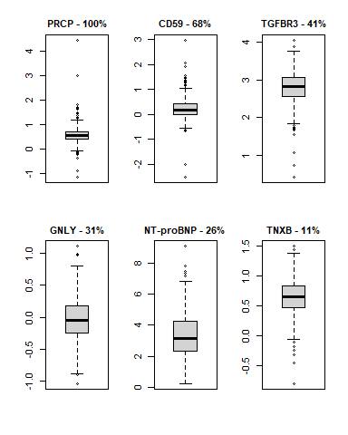
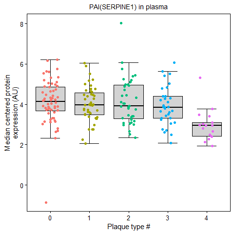
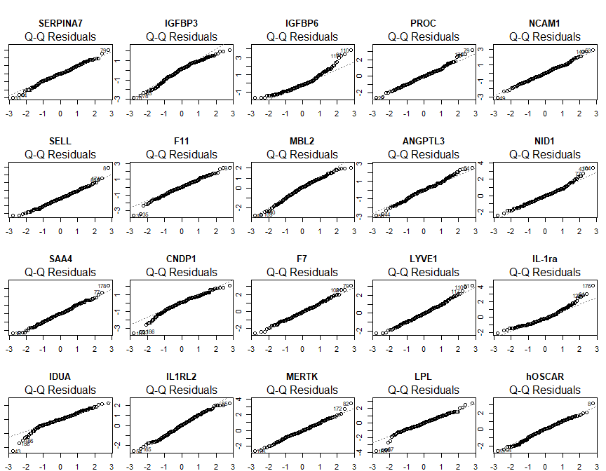
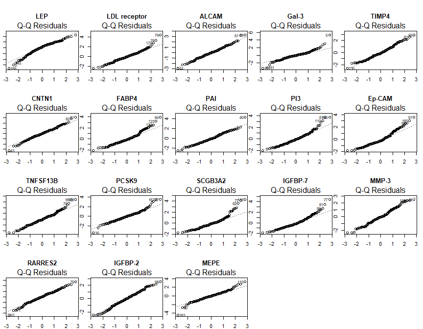
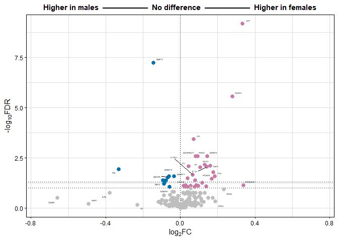

Sex-specificity in Cardiovascular Biomarkers
================
Ya Yuan Zhu

------------------------------------------------------------------------

## \| Setting up

### Importing files

First, the working directory will be set and both the raw data excel
file and text file will be imported.

``` r
#Set working directory.
setwd("C:/Users/YaYua/OneDrive/Documenten/School/2022-2023/Research project/Practical part")

#Import the sheets from the excel file and the text file.
library(readxl)

sheet_names = excel_sheets("20200706_AtheroExpress_OlinkData_forR.xlsx")

CVD2 = read_xlsx(
  "20200706_AtheroExpress_OlinkData_forR.xlsx",
  sheet = sheet_names[2]
)

CVD3 = read_xlsx(
  "20200706_AtheroExpress_OlinkData_forR.xlsx",
  sheet = sheet_names[3]
)

CM = read_xlsx(
  "20200706_AtheroExpress_OlinkData_forR.xlsx",
  sheet = sheet_names[4]
)

patient_cluster = read.delim("Seurat_clusters.txt")
```

Thereafter, the imported files are quality checked.

``` r
#CVD2
class(CVD2)
dim(CVD2)
sum(is.na(CVD2))

#CVD3
class(CVD3)
dim(CVD3)
sum(is.na(CVD3))

#CM
class(CM)
dim(CM)
sum(is.na(CM))

#Patient clusters
class(patient_cluster)
dim(patient_cluster)
sum(is.na(patient_cluster))
```

From the raw data excel file, certain proteins showed protein expression
levels that deviate from the expectations and are not acceptable.
Visualizing some of these proteins will help with deciding whether to
exclude them altogether or set a threshold for the acceptable amount of
missing data frequency.

``` r
par(mfrow=c(2,3), mar=c(3,3,2,1), oma=c(1,1,1,1))

boxplot(CM$PRCP, main = "PRCP - 100%", cex.main = 1) #100% missing data frequency
boxplot(CM$CD59, main = "CD59 - 68%", cex.main = 1) #68% missing data frequency
boxplot(CM$TGFBR3, main = "TGFBR3 - 41%", cex.main = 1) #41% missing data frequency
boxplot(CM$GNLY, main = "GNLY - 31%", cex.main = 1) #31% missing data frequency
boxplot(CVD3$`NT-proBNP`, main = "NT-proBNP - 26%", cex.main = 1) #26% missing data frequency
boxplot(CM$TNXB, main = "TNXB - 11%", cex.main = 1) #11% missing data frequency
```

<!-- -->

From 31% and lower, the outliers seem to be more acceptable. Therefore,
a threshold will be set to include only proteins with a missing data
frequency below 40%.

### Data frame preparation

#### Data filtering

The data will be filtered according to the following requirements:

- QC Warning = Pass

- Missing data frequency \< 40%

``` r
#First, the patients who did not pass the QC Warning will be removed. The last two rows out of the filter are excluded from this filter and will be carried over to the new data frame.
CVD2_pass = subset(CVD2, !(`QC Warning` == "Warning" & seq_along(`QC Warning`) <= (nrow(CVD2)-2)))
CVD3_pass = subset(CVD3, !(`QC Warning` == "Warning" & seq_along(`QC Warning`) <= (nrow(CVD3)-2)))
CM_pass = subset(CM, !(`QC Warning` == "Warning" & seq_along(`QC Warning`) <= (nrow(CM)-2)))

#Then, the columns who have a missing data frequency above or equal to 0.4 (40%) need to be excluded. The rows in the data frames are tested on whether they are below (TRUE) or above (FALSE) the 40%. The first column and last four columns are excluded from the filter.
filter_CVD2 = CVD2_pass[nrow(CVD2_pass), -c(1, (ncol(CVD2_pass)-3):ncol(CVD2_pass))] < 0.4

#A new data frame is created where all the columns except the first column and the last four columns are subsetted with the columns that were found TRUE.
CVD2_pass_40 = CVD2_pass[, -c(1, (ncol(CVD2_pass)-3):ncol(CVD2_pass))][, c(filter_CVD2)]

#The first column and the last four columns are readded to the new data frame.
CVD2_pass_40 = cbind(CVD2_pass[, 1], CVD2_pass_40, CVD2_pass[, (ncol(CVD2_pass)-3):ncol(CVD2_pass)])

#Now for the other two data frames:
filter_CVD3 = CVD3_pass[nrow(CVD3_pass), -c(1, (ncol(CVD3_pass)-3):ncol(CVD3_pass))] < 0.4
CVD3_pass_40 = CVD3_pass[, -c(1, (ncol(CVD3_pass)-3):ncol(CVD3_pass))][, c(filter_CVD3)]
CVD3_pass_40 = cbind(CVD3_pass[, 1], CVD3_pass_40, CVD3_pass[, (ncol(CVD3_pass)-3):ncol(CVD3_pass)])

filter_CM = CM_pass[nrow(CM_pass), -c(1, (ncol(CM_pass)-3):ncol(CM_pass))] < 0.4
CM_pass_40 = CM_pass[, -c(1, (ncol(CM_pass)-3):ncol(CM_pass))][, c(filter_CM)]
CM_pass_40 = cbind(CM_pass[, 1], CM_pass_40, CM_pass[, (ncol(CM_pass)-3):ncol(CM_pass)])
```

#### Tidying data frames

Some of the patient identifiers have “ae/AE” in front of them. In order
to make the data frames more consistent and clean, “ae/AE” will be
removed. Additionally, the column name for the patient identifiers are
renamed from “assay” to “patient”.

``` r
#The column name is changed from "assay" to "patient".
names(patient_cluster)[1] = "patient"
names(CVD2_pass_40)[1] = "patient"
names(CVD3_pass_40)[1] = "patient"
names(CM_pass_40)[1] = "patient"

#ae/AE are removed from the patient identifiers.
patient_cluster$patient = gsub("ae|AE", "", patient_cluster$patient)
CVD2_pass_40$patient = gsub("^ae|AE", "", CVD2_pass_40$patient)
CVD3_pass_40$patient = gsub("^ae|AE", "", CVD3_pass_40$patient)
CM_pass_40$patient = gsub("^ae|AE", "", CM_pass_40$patient)
```

#### Cluster assignment

Not all the patients have been matched with a specific
transcriptomic-based plaque type (cluster) identified previously by
Mokry *et al*. and colleagues \[1\]. Those patients need to be removed
from the data frames. Additionally, a new column will be added
displaying which cluster is found in the patient.

``` r
#If the identifier of the patient is found in "patient_cluster", then these rows are added to a new data frame.
CVD2_cluster = subset(CVD2_pass_40, patient %in% patient_cluster$patient)
CVD3_cluster = subset(CVD3_pass_40, patient %in% patient_cluster$patient)
CM_cluster = subset(CM_pass_40, patient %in% patient_cluster$patient)

#The two data frames are merged together according to the common column "patient" in order to include the cluster matched to the patient.
merged_CVD2 = merge(patient_cluster, CVD2_cluster, by = "patient")
merged_CVD3 = merge(patient_cluster, CVD3_cluster, by = "patient")
merged_CM = merge(patient_cluster, CM_cluster, by = "patient")
```

The merged files now only contain the data that has been filtered on the
“QC Warning” and the “missing data frequency”, and patients who have
been assigned a cluster.

------------------------------------------------------------------------

## \| Recreate PAI box plot from Mokry *et al*., 2022

In the article of Mokry *et al*., plasminogen activator inhibitor (PAI)
was the only circulatory biomarker found to be significantly decreased
in patients with plaque type 4 (FDR q-value = 0.016) \[1\]. To ascertain
if the data has been correctly imported and modified, the PAI boxplot
from the article (Figure 5B) will be recreated.

``` r
#The numbers indicating the cluster types are converted to factors in order to treat the values as categories instead of numerical values.
merged_CVD3$cluster = as.factor(merged_CVD3$cluster)

#The colors that are used for the individual data points.
myColors = c("#F8766D", "#A3A500", "#00BF7D", "#00B0F6", "#E76BF3")

#Making the boxplot.
p = ggplot(merged_CVD3, 
           aes(x = cluster, 
               y = PAI)) +
  #Adding the whiskers.
  stat_boxplot(geom = "errorbar", 
               width = 0.5, 
               aes(group = cluster)) +
  #Coloring the boxes of the boxplot and excluding the outliers since those will be shown with the individual points.
  geom_boxplot(fill = "#D3D3D3", 
               color = "black",
               outlier.shape = NA,
               aes(group = cluster)) +
  #Adding the individual points and spreading them out within the boundaries of the box.
  geom_jitter(position = position_jitter(width = 0.2),
              aes(color = cluster)) +
  #Adding the custom colors to the individual points.
  scale_color_manual(values = myColors) +
  #Adding labels to the boxplot.
  labs(title = "PAI(SERPINE1) in plasma", 
       y = "Median centered protein\nexpression (AU)", 
       x = "Plaque type #")

#Further customization of the boxplot.
p + theme_linedraw() + theme(
  panel.grid.major = element_blank(), 
  panel.grid.minor = element_blank(), 
  plot.title = element_text(hjust = 0.5, size = 10.5),
  legend.position = "none",
  axis.text.x = element_text(size = 10),
  axis.text.y = element_text(size = 10))
```

<!-- -->

The made box plot does seem to be similar to the figure from Mokry *et
al*. \[1\]. The box plots are showing the same pattern regarding their
height respective to each other. However, the median is centered around
4 AU instead of 0 AU as in the article. This is due to normalization of
the data done by the researchers. Despite that, it can be concluded that
the current data frames have both been imported and modified correctly.

------------------------------------------------------------------------

## \| Statistical analysis

### Preparing clinical data

In order to assess whether there are sex-based differences in the
measured circulatory biomarkers, the clinical data of the patients are
needed. First, the necessary text file is imported.

``` r
#Import of the text file.
clinical_data = read.delim("C:/Users/YaYua/OneDrive/Documenten/School/2022-2023/Research project/Practical part/clinical_data_good_selection.txt")

#Quality check of imported file.
class(CVD3)
dim(CVD3)
sum(is.na(CVD3))

#Removing ae/AE from the patient identifiers.
clinical_data$patient = gsub("^ae|AE", "", clinical_data$patient)
```

Not all of the patients are present in the created data frames
(merged_CVD2/CVD3/CM). Therefore, only the clinical data of the patients
that are in these data frames will be included in new data frames.

``` r
#If the number of the patient is found in the merged_dataset, then these rows are added to a new data frame.
clinical_data_CVD2 = subset(clinical_data, patient %in% merged_CVD2$patient)
clinical_data_CVD3 = subset(clinical_data, patient %in% merged_CVD3$patient)
clinical_data_CM = subset(clinical_data, patient %in% merged_CM$patient)
```

Now that only the necessary clinical data is left, the sex of the
patient is added to the data frames containing the patient’s protein
expression levels.

``` r
#Select the "sex" column from the clinical data.
columns_CVD2 = select(clinical_data_CVD2, patient, sex)
columns_CVD3 = select(clinical_data_CVD3, patient, sex)
columns_CM = select(clinical_data_CM, patient, sex)

#Add the selected columns to the protein expression data frames.
cd_merge_CVD2 = merge(columns_CVD2, merged_CVD2, by = "patient", all.x = TRUE)
cd_merge_CVD3 = merge(columns_CVD3, merged_CVD3, by = "patient", all.x = TRUE)
cd_merge_CM = merge(columns_CM, merged_CM, by = "patient", all.x = TRUE)
```

For the upcoming analyses, all of the measured protein expression levels
will be merged into one large data frame.

``` r
#Merge all three panels by the column "patient".
two_panels = merge(cd_merge_CM, cd_merge_CVD2, by = "patient", all.x = TRUE)
all_panels = merge(two_panels, cd_merge_CVD3, by = "patient", all.x = TRUE)

#Remove columns from the data frame, these are either repeat columns "patient" and "sex" or contain unneeded data for the statistical test.
all_panels = all_panels[,-81:-86]
all_panels = all_panels[,-168:-173]
all_panels = all_panels[,-259:-262]

#Rename columns
names(all_panels)[2] = "sex"
names(all_panels)[3] = "cluster"
```

#### Clinical data statistical analysis

The characteristics of the patients will be analysed to determine
whether they differ between the sexes.

``` r
#Make a data frame containing all of the clinical data from the study cohort.
cohort_cd = clinical_data[clinical_data$patient %in% all_panels$patient, ]
```

For the characteristics “age” and “creatinine”, unpaired two-samples
t-tests will be performed. However, first it needs to be confirmed
whether the samples are normally distributed and variances are equally
distributed.

``` r
#Age
with(cohort_cd, shapiro.test(age[sex == "male"])) #p-value = 0.1
```

    ## 
    ##  Shapiro-Wilk normality test
    ## 
    ## data:  age[sex == "male"]
    ## W = 0.98477, p-value = 0.1148

``` r
with(cohort_cd, shapiro.test(age[sex == "female"])) #p-value = 0.08
```

    ## 
    ##  Shapiro-Wilk normality test
    ## 
    ## data:  age[sex == "female"]
    ## W = 0.95733, p-value = 0.07873

``` r
var.test(age ~ sex, data = cohort_cd) #p-value = 1.00
```

    ## 
    ##  F test to compare two variances
    ## 
    ## data:  age by sex
    ## F = 0.98952, num df = 47, denom df = 142, p-value = 0.9967
    ## alternative hypothesis: true ratio of variances is not equal to 1
    ## 95 percent confidence interval:
    ##  0.6354835 1.6298574
    ## sample estimates:
    ## ratio of variances 
    ##          0.9895183

``` r
#Creatinine
with(cohort_cd, shapiro.test(creat[sex == "male"])) #p-value = < 0.001
```

    ## 
    ##  Shapiro-Wilk normality test
    ## 
    ## data:  creat[sex == "male"]
    ## W = 0.87582, p-value = 1.826e-09

``` r
with(cohort_cd, shapiro.test(creat[sex == "female"])) #p-value < 0.001
```

    ## 
    ##  Shapiro-Wilk normality test
    ## 
    ## data:  creat[sex == "female"]
    ## W = 0.77074, p-value = 3.008e-07

``` r
var.test(creat ~ sex, data = cohort_cd) #p-value = 0.05
```

    ## 
    ##  F test to compare two variances
    ## 
    ## data:  creat by sex
    ## F = 0.61043, num df = 47, denom df = 139, p-value = 0.05292
    ## alternative hypothesis: true ratio of variances is not equal to 1
    ## 95 percent confidence interval:
    ##  0.3914134 1.0064193
    ## sample estimates:
    ## ratio of variances 
    ##          0.6104268

While normality and homogeneity can be assumed for the data of “age”,
“creat” returned significant p-values (\> 0.05). This means that an
unpaired two-samples t-test can be done on “age”, but not on “creat”.

``` r
#Unpaired two-samples t-test on "age".
age_res = t.test(age ~ sex, data = cohort_cd, var.equal = TRUE)
age_res #p-value = 0.3562
```

    ## 
    ##  Two Sample t-test
    ## 
    ## data:  age by sex
    ## t = -0.92495, df = 189, p-value = 0.3562
    ## alternative hypothesis: true difference in means between group female and group male is not equal to 0
    ## 95 percent confidence interval:
    ##  -4.050440  1.464484
    ## sample estimates:
    ## mean in group female   mean in group male 
    ##             68.89583             70.18881

``` r
#Unpaired two-samples Wilcoxon test
creat_res = wilcox.test(creat ~ sex, data = cohort_cd, exact = FALSE)
creat_res #p-value = < 0.001
```

    ## 
    ##  Wilcoxon rank sum test with continuity correction
    ## 
    ## data:  creat by sex
    ## W = 1421.5, p-value = 2.549e-09
    ## alternative hypothesis: true location shift is not equal to 0

For the categorical variables, a chi-square for independence test will
be done to analyse whether there are differences between the sexes.

``` r
#Secondary events
sec_events_res = chisq.test(cohort_cd$secondary_events, cohort_cd$sex)
sec_events_res #p-value = 0.085
```

    ## 
    ##  Pearson's Chi-squared test with Yates' continuity correction
    ## 
    ## data:  cohort_cd$secondary_events and cohort_cd$sex
    ## X-squared = 2.958, df = 1, p-value = 0.08545

``` r
#Symptoms
symp_res = chisq.test(cohort_cd$symptoms_inclusion, cohort_cd$sex)
symp_res #p-value = 0.490
```

    ## 
    ##  Pearson's Chi-squared test
    ## 
    ## data:  cohort_cd$symptoms_inclusion and cohort_cd$sex
    ## X-squared = 1.4259, df = 2, p-value = 0.4902

``` r
#Stenosis
sten_res = chisq.test(cohort_cd$stenose, cohort_cd$sex)
sten_res #p-value = 0.544
```

    ## 
    ##  Pearson's Chi-squared test
    ## 
    ## data:  cohort_cd$stenose and cohort_cd$sex
    ## X-squared = 3.0829, df = 4, p-value = 0.544

``` r
#Plaque phenotype
plaque_res = chisq.test(cohort_cd$plaquephenotype, cohort_cd$sex)
plaque_res #p-value = 0.001
```

    ## 
    ##  Pearson's Chi-squared test
    ## 
    ## data:  cohort_cd$plaquephenotype and cohort_cd$sex
    ## X-squared = 13.026, df = 2, p-value = 0.001484

``` r
plaque = table(cohort_cd$plaquephenotype, cohort_cd$sex)
chisq.theo.multcomp(plaque, p.method = "bonferroni")
```

    ## 
    ##         Pairwise comparisons using chi-squared tests
    ## 
    ## data:  plaque and bonferroni
    ## 
    ##      observed.Var1 observed.Var2 observed.Freq expected    Chi  Pr(>Chi)    
    ##       atheromatous        female             6     31.5 24.771 3.873e-06 ***
    ##  fibroatheromatous        female            17     31.5  8.010 2.792e-02   *
    ##            fibrous        female            24     31.5  2.143 8.594e-01    
    ##       atheromatous          male            54     31.5 19.286 6.753e-05 ***
    ##  fibroatheromatous          male            49     31.5 11.667 3.818e-03  **
    ##            fibrous          male            39     31.5  2.143 8.594e-01    
    ## 
    ## P value adjustment method: bonferroni

``` r
#Fat
fat_res = chisq.test(cohort_cd$fat, cohort_cd$sex)
fat_res #p-value = 0.006
```

    ## 
    ##  Pearson's Chi-squared test
    ## 
    ## data:  cohort_cd$fat and cohort_cd$sex
    ## X-squared = 10.337, df = 2, p-value = 0.005692

``` r
fat = table(cohort_cd$fat, cohort_cd$sex)
chisq.theo.multcomp(fat, p.method = "bonferroni")
```

    ## 
    ##         Pairwise comparisons using chi-squared tests
    ## 
    ## data:  fat and bonferroni
    ## 
    ##  observed.Var1 observed.Var2 observed.Freq expected       Chi  Pr(>Chi)    
    ##      < 40% fat        female            24     31.5  2.142857 8.594e-01    
    ##      > 40% fat        female             6     31.5 24.771429 3.873e-06 ***
    ##         no fat        female            17     31.5  8.009524 2.792e-02   *
    ##      < 40% fat          male            57     31.5 24.771429 3.873e-06 ***
    ##      > 40% fat          male            53     31.5 17.609524 1.627e-04 ***
    ##         no fat          male            32     31.5  0.009524 1.000e+00    
    ## 
    ## P value adjustment method: bonferroni

### One-way ANOVA: identifying sex-specific biomarkers

Multiple one-way ANOVAs will be performed, implementing each protein in
the data frame, in order to assess whether the protein expression levels
differ between the sexes. The Benjamini and Hochberg (BH) method will be
used to correct for multiple testing.

``` r
#Change scientific notation to decimals.
options(scipen = 999, digits = 6)

#Empty data frame to store the results of the one-way ANOVA.
resaov = data.frame(protein = character(),
                            F.value = numeric(),
                            p.value = numeric(),
                            Mean.sq = numeric(),
                            stringsAsFactors = FALSE)

#Loop for inserting each protein into a one-way ANOVA analysis.
for (i in 4:(ncol(all_panels))){
  anova_result = summary(aov(all_panels[,i]~sex, data = all_panels))
  F_value = anova_result[[1]][[4]][1]
  p_value = anova_result[[1]][[5]][1]
  mean_sq = anova_result[[1]][[3]][1]
  resaov = rbind(resaov, data.frame(protein = colnames(all_panels)[i],
                                                  F.value = F_value,
                                                  p.value = p_value,
                                                  Mean.sq = mean_sq,
                                                  stringsAsFactors = FALSE))
}

#Adjust the p-values using the Benjamini-Hochberg correction.
resaov$FDR = p.adjust(resaov$p.value, method = "BH")


#Which protein(s) has/have been found significant (FDR q-value < 0.1 and < 0.05)? This will show both their non-adjusted, adjusted p-values, mean square, and the F-value.
s_protein_1 = subset(resaov, resaov$FDR < 0.1)
s_protein_05 = subset(resaov, resaov$FDR < 0.05)
```

#### Results

Using a FDR q-value \< 0.1 as the significance threshold, 38 proteins
were found to differ in their expression level between the sexes. Among
the 38 proteins, 24 had a FDR q-value below 0.05. Before conclusion can
be made, the assumptions of each significant protein needs to be tested.
The Levene’s test will be used to test for homogeneity and a Q-Q plot
for the normality.

``` r
res_lev = data.frame(protein = character(),
                         p.value = numeric())

par(mfrow=c(4, 5), mar = c(2, 1, 5, 1))

for(i in 1:nrow(s_protein_1)){
  protein = s_protein_1[i, "protein"]
  protein_data = all_panels[, c("sex", protein)]
  levene_result = leveneTest(protein_data[, 2] ~ protein_data[, 1])
  p_value = levene_result[1, 3]
  res_lev = rbind(res_lev, data.frame(protein = protein,
                                      p.value = p_value))
  plot(aov(protein_data[, 2] ~ protein_data[, 1], data = all_panels), 2, main = protein)
}
```

<!-- --><!-- -->

From the results of the Levene’s test, no protein is found significant,
meaning homogeneity can be assumed. Furthermore, the points on the Q-Q
plot seem to fall approximately on the reference line. Therefore,
normality can also be assumed.

To determine whether the protein is expressed higher in males or
females, their descriptive statistics are needed.

``` r
#Add columns to the data frame resaov containing the results of the one-way ANOVA with the mean expression levels of all the proteins in females and males.
for (i in 1:nrow(resaov)){
  if(resaov$protein[i] %in% colnames(cd_merge_CM)){
    descriptive_stats = describeBy(cd_merge_CM[resaov$protein[i]], group = cd_merge_CM$sex)
    resaov$female[i] = descriptive_stats[[1]][[3]][1]
    resaov$male[i] = descriptive_stats[[2]][[3]][1]
  }
  if(resaov$protein[i] %in% colnames(cd_merge_CVD2)){
    descriptive_stats = describeBy(cd_merge_CVD2[resaov$protein[i]], group = cd_merge_CVD2$sex)
    resaov$female[i] = descriptive_stats[[1]][[3]][1]
    resaov$male[i] = descriptive_stats[[2]][[3]][1]
  }
  if(resaov$protein[i] %in% colnames(cd_merge_CVD3)){
    descriptive_stats = describeBy(cd_merge_CVD3[resaov$protein[i]], group = cd_merge_CVD3$sex)
    resaov$female[i] = descriptive_stats[[1]][[3]][1]
    resaov$male[i] = descriptive_stats[[2]][[3]][1]
  }
}

#Add a column to the data frame displaying whether the protein is higher in females, males, or non-significant.
resaov <- resaov %>% 
  mutate(
    significance = case_when(resaov$female/resaov$male > 1 & FDR < 0.1 ~ "Higher in females",
                           resaov$female/resaov$male < 1 & FDR < 0.1 ~ "Higher in males",
                           TRUE ~ "Not significant")
    )

#Subset the rows again with a FDR q-value below 0.1. This will add the columns with the mean protein expression levels and significance to the data frame containing all the significant proteins.
s_protein_1 = subset(resaov, resaov$FDR < 0.1)
s_protein_05 = subset(resaov, resaov$FDR < 0.05)

#Display a table of the results.
library(knitr)
kable(s_protein_1)
```

|     | protein      |  F.value |  p.value |   Mean.sq |      FDR |   female |     male | significance      |
|:----|:-------------|---------:|---------:|----------:|---------:|---------:|---------:|:------------------|
| 6   | SERPINA7     | 16.40763 | 0.000075 |  1.951254 | 0.002714 |  4.23016 |  3.99715 | Higher in females |
| 7   | IGFBP3       | 16.76468 | 0.000063 |  3.689797 | 0.002714 |  3.37893 |  3.05850 | Higher in females |
| 11  | IGFBP6       |  6.20914 | 0.013570 |  1.448978 | 0.091062 |  5.05319 |  5.25398 | Higher in males   |
| 18  | PROC         | 16.53165 | 0.000070 |  1.900139 | 0.002714 |  3.65865 |  3.42871 | Higher in females |
| 20  | NCAM1        |  8.53896 | 0.003900 |  0.914338 | 0.042392 |  2.43752 |  2.59703 | Higher in males   |
| 26  | SELL         |  6.93504 | 0.009152 |  0.726441 | 0.077793 |  7.39182 |  7.24965 | Higher in females |
| 27  | F11          | 13.34038 | 0.000336 |  1.366846 | 0.008575 |  6.34123 |  6.14620 | Higher in females |
| 30  | MBL2         |  7.47420 | 0.006854 |  9.161013 | 0.064730 |  8.16826 |  8.67316 | Higher in males   |
| 32  | ANGPTL3      |  6.75145 | 0.010106 |  1.319393 | 0.080529 |  4.99971 |  4.80810 | Higher in females |
| 35  | NID1         |  7.76110 | 0.005882 |  1.116447 | 0.057694 |  2.94673 |  3.12299 | Higher in males   |
| 51  | SAA4         | 14.09691 | 0.000231 |  5.139112 | 0.007364 |  4.34748 |  3.96932 | Higher in females |
| 52  | CNDP1        |  7.07762 | 0.008476 |  2.393969 | 0.076245 |  4.49210 |  4.23400 | Higher in females |
| 59  | F7           | 12.69217 | 0.000465 |  1.582521 | 0.009877 |  2.94613 |  2.73628 | Higher in females |
| 61  | LYVE1        | 10.58701 | 0.001349 |  1.843309 | 0.022936 |  5.07069 |  4.84421 | Higher in females |
| 87  | IL-1ra       | 13.04736 | 0.000391 |  9.021522 | 0.009056 |  5.28379 |  4.78698 | Higher in females |
| 91  | IDUA         |  6.23837 | 0.013369 |  2.098282 | 0.091062 |  4.85184 |  4.59972 | Higher in females |
| 98  | IL1RL2       |  8.55941 | 0.003866 |  1.660592 | 0.042392 |  4.03228 |  3.81405 | Higher in females |
| 122 | MERTK        |  9.63509 | 0.002207 |  1.630942 | 0.029623 |  4.65557 |  4.86969 | Higher in males   |
| 142 | LPL          | 21.72218 | 0.000006 |  6.538880 | 0.000382 |  9.01543 |  8.58227 | Higher in females |
| 155 | hOSCAR       |  6.79435 | 0.009886 |  0.637577 | 0.080529 | 10.34849 | 10.22050 | Higher in females |
| 158 | LEP          | 56.06020 | 0.000000 | 73.821398 | 0.000000 |  7.00737 |  5.55660 | Higher in females |
| 166 | LDL receptor |  6.47274 | 0.011754 |  1.865014 | 0.088155 |  2.89669 |  2.62970 | Higher in females |
| 174 | ALCAM        |  9.30299 | 0.002616 |  0.635319 | 0.033359 |  6.39357 |  6.22449 | Higher in females |
| 180 | Gal-3        | 13.68259 | 0.000284 |  2.108872 | 0.008037 |  2.61022 |  2.33587 | Higher in females |
| 187 | TIMP4        |  7.85724 | 0.005590 |  1.610361 | 0.057015 |  3.04076 |  2.80166 | Higher in females |
| 188 | CNTN1        |  6.69156 | 0.010438 |  1.083576 | 0.080661 |  3.02316 |  2.82541 | Higher in females |
| 191 | FABP4        | 33.13676 | 0.000000 | 31.740254 | 0.000003 |  5.40373 |  4.44901 | Higher in females |
| 193 | PAI          |  9.93258 | 0.001888 |  9.434325 | 0.026753 |  4.35732 |  3.83307 | Higher in females |
| 210 | PI3          | 12.10497 | 0.000624 |  7.204381 | 0.012245 |  1.63661 |  2.05749 | Higher in males   |
| 211 | Ep-CAM       |  9.03150 | 0.003014 |  8.407997 | 0.036595 |  4.70073 |  4.18123 | Higher in females |
| 218 | TNFSF13B     |  6.35022 | 0.012565 |  0.819250 | 0.088999 |  6.39460 |  6.21500 | Higher in females |
| 220 | PCSK9        | 11.27890 | 0.000948 |  2.018915 | 0.017268 |  2.18945 |  1.93469 | Higher in females |
| 237 | SCGB3A2      |  7.03535 | 0.008671 |  6.471857 | 0.076245 |  2.09932 |  1.65836 | Higher in females |
| 239 | IGFBP-7      |  9.94764 | 0.001874 |  1.432789 | 0.026753 |  6.66838 |  6.82810 | Higher in males   |
| 245 | MMP-3        | 43.17375 | 0.000000 | 17.071361 | 0.000000 |  6.05091 |  6.68223 | Higher in males   |
| 246 | RARRES2      |  6.35239 | 0.012550 |  0.924664 | 0.088999 | 11.12980 | 10.91261 | Higher in females |
| 251 | IGFBP-2      |  9.97757 | 0.001845 |  4.504867 | 0.026753 |  7.25753 |  7.56757 | Higher in males   |
| 254 | MEPE         |  8.49570 | 0.003990 |  2.342408 | 0.042392 |  4.13762 |  4.35825 | Higher in males   |

------------------------------------------------------------------------

## \| Plotting results

``` r
#Create the volcano plot.
vplot = ggplot(resaov, aes(x = log2(female/male), y = -log10(FDR))) +
  #Add horizontal and vertical dotted lines showing the thresholds for protein expression and significance.
  geom_hline(yintercept= -log10(0.05), linetype="dotted", linewidth = 0.5) +
  geom_hline(yintercept= -log10(0.1), linetype="dotted", linewidth = 0.5) +
  geom_vline(xintercept = 0, linetype="dotted", linewidth = 0.5) +
  #Customizing data points.
  geom_point(aes(color = significance), size = 2.5) +
  scale_color_manual(values = c("#CC79A7", "#0072B2", "grey")) +
  #Setting x-axis limit.
  xlim(-0.75, 0.75) +
  #Adding labels.
  labs(title = "Higher in males  ——————  No difference  ——————  Higher in females", 
       y = expression("-log"[10]*"FDR"), 
       x = expression("log"[2]*"FC")) + 
  #Theme
  theme_linedraw() + 
  #Customizing plot further.
  theme(panel.grid = element_line(color = "#DDDDDD"), 
        plot.title = element_text(hjust = 0.5, size = 11, face = "bold"),
        legend.position = "none",
        axis.text.x = element_text(size = 9), 
        axis.text.y = element_text(size = 9)) +
#Adding names to the respective data points.
  geom_text_repel(data = resaov,
                  mapping = aes(log2(female/male), -log10(FDR), label = protein),
                  size = 1)
vplot
```

<!-- -->

------------------------------------------------------------------------

## \| References

1.  Mokry M, Boltjes A, Slenders L, Bel-Bordes G, Cui K, Brouwer E, et
    al. Transcriptomic-based clustering of human atherosclerotic plaques
    identifies subgroups with different underlying biology and clinical
    presentation. Nat Cardiovasc Res. 2022 Dec;1(12):1140–55.
